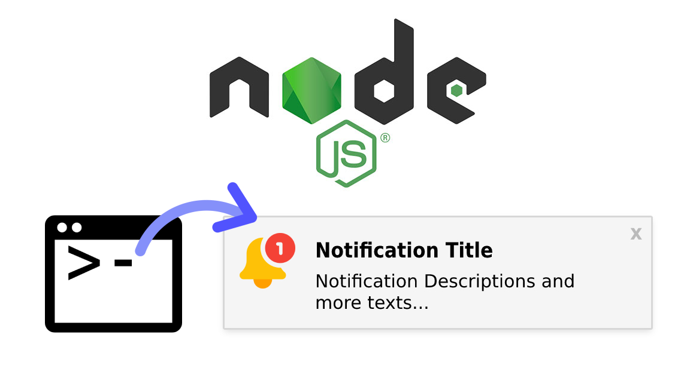

<p align="center">
  
</p>

<h1 align="center">Tutorial Node.js CLI System Notification</h1>

<p align="center">🧠 Improve the User Experience in your CLI Application adding 🔔 System Notifications.</p>

<p align="center">
  <a title="MIT License" href="LICENSE.md">
    
  </a>
  <a title="Twitter: JoseJ_PR" href="https://twitter.com/JoseJ_PR">
    
  </a>  
  <a title="Github: Sponsors" href="https://github.com/sponsors/JoseJPR">
    
  </a>
  <br />
  <br />
</p>

## 🔖 Description

With this repository you will learn which libraries to use and how, in order to improve the user experience in your CLI Applications.

Imagine that you need to develop a CLI Application with Node.js that executes one or more than one task and that takes time, several minutes. You could notify the user when these tasks are finished and that in this way they do not have to be checking the CLI from time to time.

[NPM Node Notifier](https://www.npmjs.com/package/node-notifier) \
[NPM Jimp](https://www.npmjs.com/package/jimp)

## 📹 Video Demo

The following video shows how you can run this application.

[](https://youtu.be/gCB9mEYqkdI)

## 📌 Methodologies and Guidelines

List of methodologies and tools used in this project for compliance with Quality Assurance Code (QAC)

* ESTlint, tool for identifying and reporting on patterns found in ECMAScript/JavaScript code. \
  [NPM ESLint](https://www.npmjs.com/package/eslint) \
  [NPM ESLint | Airbnb](https://www.npmjs.com/package/eslint-config-airbnb)

## ✅ Prerequisites

In order to work with this project, your local environment must have at least the following versions:

* NodeJS Version: 14.xx
* NPM Version: 7.10.0

## 📐 How to work with this project

### 1️⃣ Install Dependencies

```bash
$npm i
```

### 2️⃣ Run Application

```bash
$npm run start
```

## 📂 Code scaffolding

```any
/
├── assets 🌈               # Images Sources.
├── resources 🐱            # Severals images to transform.
├── src 📦                  # Main Node.js application.
├── tmp 📁                  # Destination directory for images.
└── ...
```

## ⛽️ Review and Update Sependencies

For review and update all npm dependencies of this project you need install in global npm package "npm-check-updates" npm module.

```bash
# Install and Run
$npm i -g npm-check-updates
$ncu
```

## License

[MIT](LICENSE.md)

## Happy Code

Created with JavaScript, lot of ❤️ and a few ☕️

## This README.md file has been written keeping in mind

[GitHub Markdown](https://guides.github.com/features/mastering-markdown/) \
[Emoji Cheat Sheet](https://www.webfx.com/tools/emoji-cheat-sheet/)
